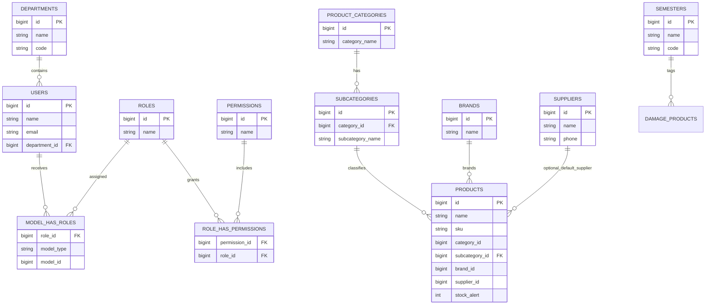
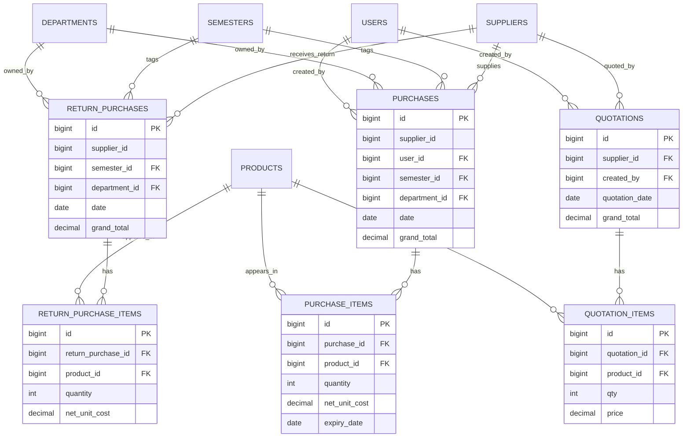
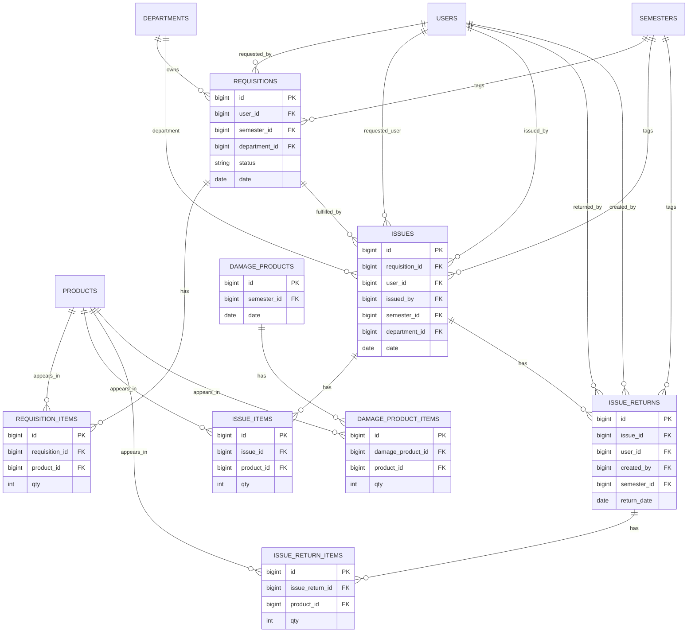

# 3-Diagram+ (Aligned to Real Table Names)

Source of truth: `store_management_system_of_bubt.sql`

## Diagram 1 — Access Control + Core Master Data

## Diagram 2 — Procurement + Return + Quotation

## Diagram 3 — Requisition + Issue + Returns + Damage

## Alignment Notes (real names vs draft names)

- `CATEGORIES` → `product_categories`
- `USER_ROLES` → `model_has_roles` (polymorphic role assignment)
- `ROLE_PERMISSIONS` → `role_has_permissions`
- `PURCHASE_RETURNS` → `return_purchases`
- `PURCHASE_RETURN_ITEMS` → `return_purchase_items`
- `DAMAGES` → `damage_products` + `damage_product_items`
- `STOCK_LEDGER` table is not present in current schema
- No direct FK from `return_purchases` to `purchases` in current schema
