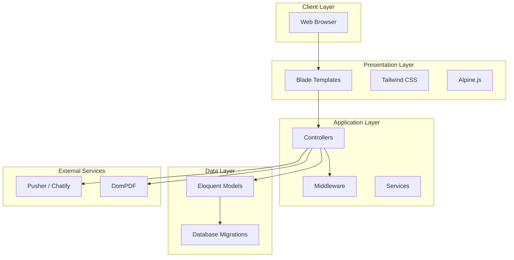
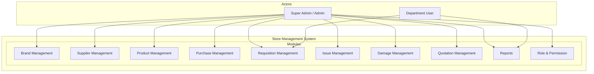
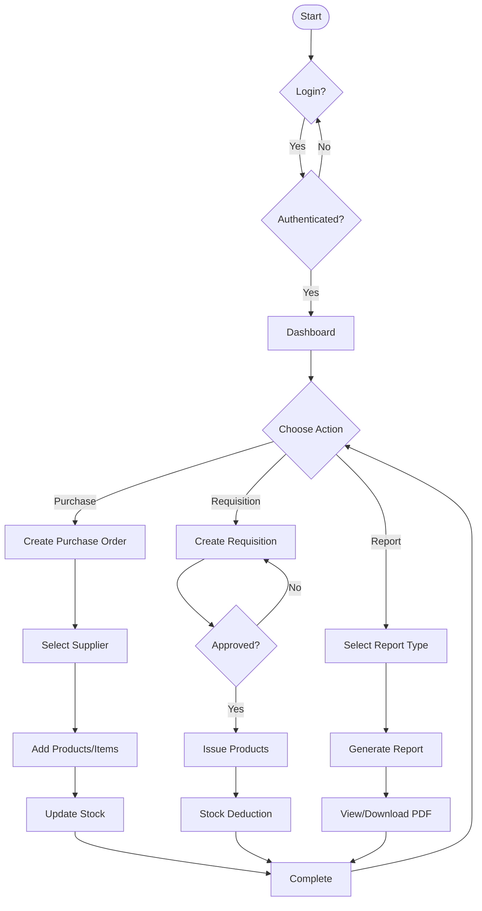
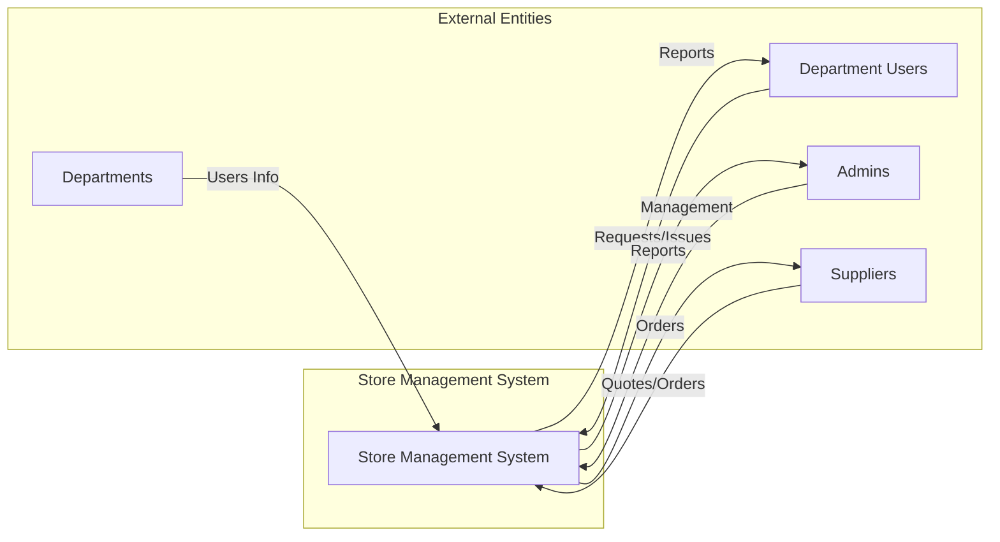
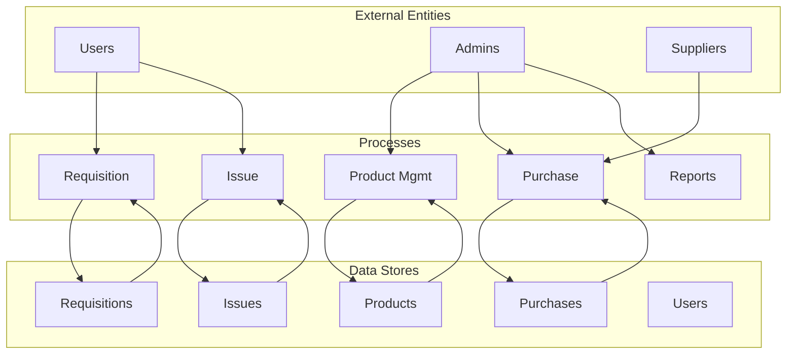
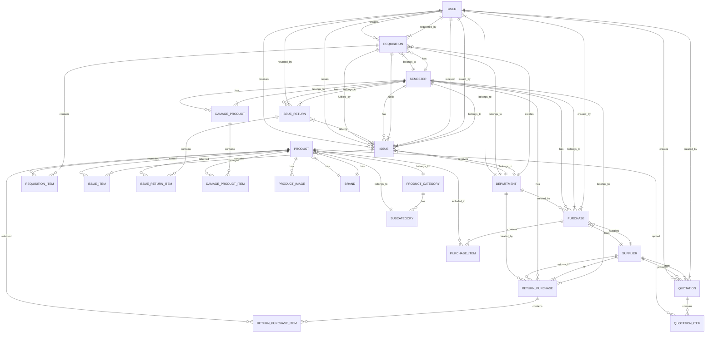
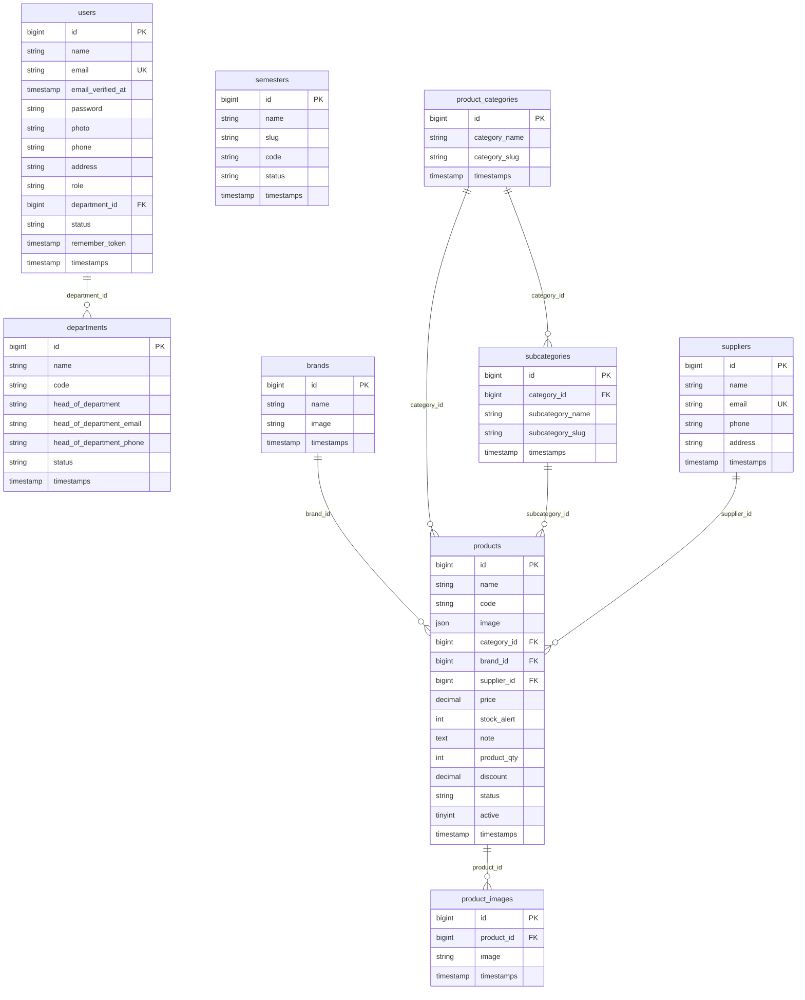
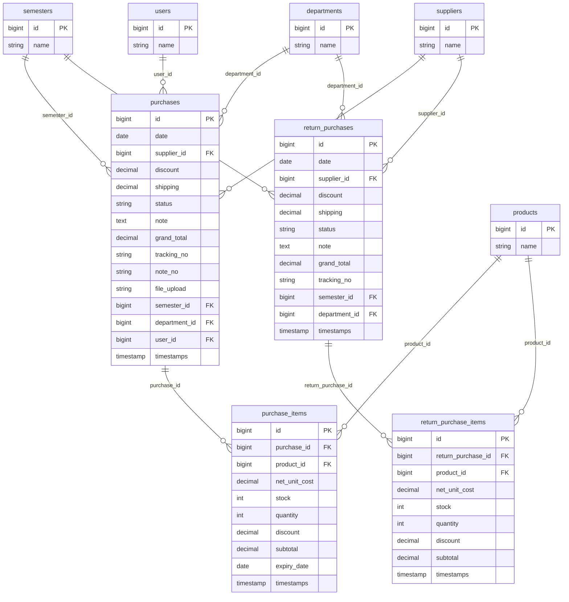
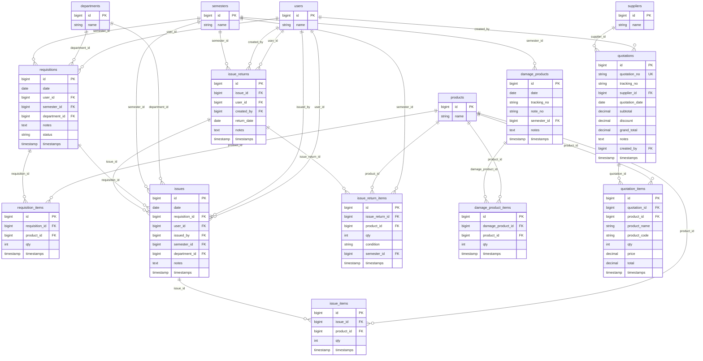

# Store Management System of BUBT
## Complete System Documentation

---

## 1. System Architecture

### 1.1 Technology Stack

| Layer | Technology |
|-------|-------------|
| **Framework** | Laravel 12.0 |
| **PHP Version** | 8.2 |
| **Database** | MySQL |
| **Frontend** | Tailwind CSS 3.x, Alpine.js 3.x, Vite 6.x |
| **Authentication** | Laravel Breeze + Spatie Permission |
| **PDF Generation** | Barryvdh Laravel DomPDF |
| **Image Handling** | Intervention Image |
| **Real-time Chat** | Chatify (Munafio) with Pusher |

### 1.2 Architecture Diagram (Mermaid)



### 1.3 Architecture Diagram (ASCII)

```
+---------------------------------------------------------------+
|                        CLIENT LAYER                          |
|                    [Web Browser]                             |
+------------------------------+-------------------------------+
                               |
                               v
+---------------------------------------------------------------+
|                    PRESENTATION LAYER                        |
|  +----------------+  +-------------+  +------------------+   |
|  | Blade Templates|  |Tailwind CSS |  |   Alpine.js     |   |
|  +----------------+  +-------------+  +------------------+   |
+------------------------------+-------------------------------+
                               |
                               v
+---------------------------------------------------------------+
|                    APPLICATION LAYER                          |
|  +----------------+  +-------------+  +------------------+   |
|  | Controllers    |  |  Middleware  |  |    Services      |   |
|  +----------------+  +-------------+  +------------------+   |
+------------------------------+-------------------------------+
                               |
                               v
+---------------------------------------------------------------+
|                       DATA LAYER                              |
|  +----------------+  +-------------+                          |
|  |Eloquent Models |  | Migrations   |                          |
|  +----------------+  +-------------+                          |
+------------------------------+-------------------------------+
                               |
                               v
+---------------------------------------------------------------+
|                   EXTERNAL SERVICES                          |
|  +----------------+  +-------------+                          |
|  | Pusher/Chatify |  |   DomPDF    |                          |
|  +----------------+  +-------------+                          |
+---------------------------------------------------------------+
```

### 1.4 Layer Description

1. **Client Layer**: End-users access the system through web browsers
2. **Presentation Layer**: Blade templates render UI with Tailwind CSS styling and Alpine.js interactivity
3. **Application Layer**: Controllers handle business logic, middleware manages authentication/authorization
4. **Data Layer**: Eloquent ORM models interact with MySQL database via migrations

---

## 2. Use Case Diagram

### 2.1 Use Case Diagram (Mermaid)



### 2.2 Use Case Diagram (ASCII)

```
+------------------------------------------------------------------+
|                         ACTORS                                    |
|  +---------------------+  +-----------------------+               |
|  |  Super Admin/Admin  |  |    Department User    |               |
|  +---------------------+  +-----------------------+               |
+-------------------------------+-----------------------------------+
                |                               |
                |       USE CASES                |
                v                               v
+------------------------------------------------------------------+
|                   STORE MANAGEMENT SYSTEM                        |
+------------------------------------------------------------------+
|                                                                  |
|  +-------------+ +-----------+ +-----------+ +-------------+    |
|  |Brand Mgmt  | |Supplier   | |Product    | | Purchase    |    |
|  |             | |Management | |Management | | Management |    |
|  +-------------+ +-----------+ +-----------+ +-------------+    |
|                                                                  |
|  +-------------+ +-----------+ +-----------+ +-------------+    |
|  |Requisition | | Issue     | | Damage    | | Quotation   |    |
|  | Management | | Management| |Product Mg| | Management |    |
|  +-------------+ +-----------+ +-----------+ +-------------+    |
|                                                                  |
|  +------------------------+ +--------------------------------+   |
|  |     Reports           | |    Role & Permission Management |   |
|  +------------------------+ +--------------------------------+   |
|                                                                  |
+------------------------------------------------------------------+
```

### 2.3 Use Case Descriptions

| Module | Actor | Description |
|--------|-------|-------------|
| Brand Management | Admin | Create, edit, delete product brands |
| Supplier Management | Admin | Manage vendor/supplier information |
| Product Management | Admin | Manage products, categories, subcategories, stock |
| Purchase Management | Admin | Create purchase orders from suppliers |
| Requisition Management | User/Admin | Request products, approve requests |
| Issue Management | Admin | Issue products to users/departments |
| Damage Management | Admin | Report and track damaged products |
| Quotation Management | Admin | Create and manage supplier quotations |
| Reports | Admin | Generate various reports |
| Role & Permission | Admin | Manage roles and permissions |

---

## 3. System Flow Chart

### 3.1 Main Process Flow (Mermaid)



### 3.2 System Flow Chart (ASCII)

```
                                    +------------------+
                                    |      START       |
                                    +--------+---------+
                                             |
                                             v
                                    +------------------+
                                    |      LOGIN       |
                                    +--------+---------+
                                             |
                                    +--------v---------+
                                    | AUTHENTICATED?   |
                                    +--------+---------+
                                       /           \
                                     NO           YES
                                     /              \
                               +----v----+    +------------+
                               |  LOGIN  |    |  DASHBOARD |
                               +---------+    +-----+------+
                                                    |
                              +---------------------+---------------------+
                              |                     |                     |
                              v                     v                     v
                     +----------------+    +----------------+    +----------------+
                     |   PURCHASE     |    | REQUISITION    |    |    REPORTS     |
                     |    FLOW        |    |    FLOW        |    |     FLOW       |
                     +--------+-------+    +--------+-------+    +--------+-------+
                              |                     |                     |
                              v                     v                     v
                     +----------------+    +----------------+    +----------------+
                     |Create Purchase |    |Create Request |    | Select Report |
                     |     Order      |    +-------+-------+    +-------+-------+
                              |                     |                     |
                              v                     v                     v
                     +----------------+    +----------------+    +----------------+
                     | Select Supplier|    |   Approved?    |    |Generate Report |
                     +-------+--------+    +-------+-------+    +-------+-------+
                              |                     |                     |
                              v           YES       v                     v
                     +----------------+ <------ +-------+        +--------------+
                     | Add Items      |         |  ISSUE |        |View/Download |
                     +-------+--------+         +---+---+        +-------+------+
                              |                     |                     |
                              v                     v                     v
                     +----------------+    +----------------+    +----------------+
                     |Update Stock    |    |Stock Deduction|    |    COMPLETE    |
                     +-------+--------+    +-------+--------+    +-------+-------+
                              |                     |                     |
                              +---------------------+---------------------+
                                              |
                                              v
                                    +------------------+
                                    |     COMPLETE     |
                                    +------------------+
```

### 3.3 Detailed Flow Descriptions

#### Purchase Flow
1. Admin creates purchase order
2. Select supplier from list
3. Add products and quantities
4. System calculates totals
5. Stock is updated upon completion

#### Requisition Flow
1. User creates requisition request
2. Admin reviews and approves/rejects
3. If approved, products are issued
4. Stock is deducted
5. User receives products

#### Issue Flow
1. Admin selects requisition or creates new issue
2. Select products and quantities
3. Assign to user or department
4. Stock is deducted
5. Issue record is created

---

## 4. Data Flow Diagram (DFD)

### 4.1 Context Diagram (Level 0) - Mermaid



### 4.2 Context Diagram (Level 0) - ASCII

```
+=========================================================================+
|                                                                         |
|   +----------------+         +-------------------------+         +--------+ |
|   |   Department   |         |    STORE MANAGEMENT    |         |Supplier| |
|   |    Users      |         |        SYSTEM           |         |        | |
|   +-------+-------+         +------------+------------+         +---+----+ |
|           |                         |                          |        |
|           |                         |                          |        |
|           |    +--------------------v---------------------+    |        |
|           +--->|                                    |<-----+        |
|                |  User Requests, Issues, Profile   |               |
|                |  Admin Management, Reports         |               |
|                |  Supplier Orders, Quotations       |               |
|                |  Department User Info              |               |
|                +------------------------------------+               |
|           |                         |                          |        |
|           |                         |                          |        |
|           |    +--------------------v---------------------+    |        |
|           <---|  Reports, Confirmations, Products    |--->         |
|                +------------------------------------+               |
|                                                                         |
+=========================================================================+
```

### 4.3 Level 1 DFD - Mermaid



### 4.4 Level 1 DFD - ASCII

```
+=========================================================================+
|                         EXTERNAL ENTITIES                               |
|    +----------+   +----------+   +----------+                         |
|    |  Users   |   |  Admins  |   |Suppliers |                         |
|    +-----+----+   +-----+----+   +-----+----+                         |
|          |             |             |                                 |
+----------|-------------|-------------|---------------------------------+
           |             |             |
           v             v             v
+------------------------------------------------+-------------------+
|                     PROCESSES                   |    DATA STORES    |
|                                                 |                   |
|    +-------------+    +-------------+          |  +----------+     |
|    |   Product   |    |  Purchase   |    +----->  | Products |     |
|    |  Management |    |   Process  |    |        +----------+     |
|    +------+------+    +------+------+    |                       |
|           |                  |            |  +----------+     |
|           |                  |            +--> Purchases  |     |
|           |                  |               | +----------+     |
|           |                  |               |                   |
|    +------+------+    +------+------+    |  +----------+     |
|    |Requisition |    |   Issue   |    +---->Requisitions|    |
|    |  Process  |    |  Process  |    |   | +----------+     |
|    +------+------+    +------+------+    |                   |
|           |                  |            |  +----------+     |
|           |                  |            +-->  Issues  |     |
|           |                  |                +----------+     |
|           |                  |                                   |
|    +------+------+    +------+------+    |  +----------+     |
|    |   Reports   |    |  Auth &  |    +---->  Users   |     |
|    |  Generation |    |   Perm   |        | +----------+     |
|    +-------------+    +----------+                                   |
|                                                 |                   |
+------------------------------------------------+-------------------+
```

---

## 5. Entity Relationship (ER) Diagram

### 5.1 ER Diagram (Mermaid)



### 5.2 ER Diagram (ASCII)

```
+=========================================================================+
|                          ENTITY RELATIONSHIPS                           |
+=========================================================================+

    +----------+                         +----------+
    |   USER   |                         |  BRAND   |
    +----+-----+                         +----+-----+
         |                                    |
         | 1,N                               | 1,N
         |<---------------------------------->|
         |                                    |
    +----v-----+         +-----------+  +----v-----+
    |  DEPT    |         |  PRODUCT  |  |   PROD   |
    +----+-----+         +-----+-----+  |  CATEGORY|
         |                     |          +-----+-----+
         | 1,N                 | 1,N            |
         |<--------------------|--------------> |
         |                     |          1,N   |
    +----v-----+         +----v-----+    +-----v-----+
    | REQUISIT |         | SUBCATE- |    |  SUPPLIER|
    |   ION   |         |   GORY   |    +-----+-----+
    +----+-----+         +-----+-----+          |
         |                     |            1,N  |
         | 1,N                 |            <---+
         |<--------------------|                |
         |                     |          +----v-----+
    +----v-----+         +-----+-----+    |  PURCHASE|
    |  ISSUE  |         |  SEMESTER|    +-----+-----+
    +----+-----+         +-----+-----+          |
         |                     |            1,N  |
         | 1,N                 |            <---+
         |<--------------------|                |
         |                     |          +----v-----+
    +----v-----+         +-----+-----+    | QUOTATION|
    | ISSUE    |         |         |    +-----+-----+
    | RETURN   |                         |          |
    +----+-----+                    1,N   |          |
         |                            <---+          |
         | 1,N                     +----v-----+      |
         |<------------------------|  PURCHASE|      |
         |                        |   ITEM   |      |
         |                        +-----+-----+      |
         |                              |            |
         |                        +----v-----+      |
         |                        |  DAMAGE  |      |
         |                        | PRODUCT  |      |
         |                        +-----+-----+      |
         |                              |            |
         +-----------------------------+------------+
                                      | 1,N
                                 +----v-----+
                                 |  REQUIS  |
                                 |   ITION  |
                                 |   ITEM   |
                                 +----------+

+=========================================================================+
|                         RELATIONSHIP LEGEND                             |
+=========================================================================+
|  1,N = One-to-Many    |    1,1 = One-to-One    |    N,N = Many-to-Many |
+=========================================================================+
```

---

## 6. Context Diagram

### 6.1 Context Diagram (Mermaid)

```mermaid
flowchart TB
    subgraph System["Store Management System of BUBT"]
        SMS[" "]
    end

    subgraph External_Entities
        Users["Department Users"]
        Admins["Admin Users"]
        Suppliers["Suppliers"]
        Depts["Departments"]
        Auth["Authentication System"]
    end

    subgraph Data_Flows
        Req["Product Requests"]
        Issue["Product Issues"]
        Orders["Purchase Orders"]
        Reports["Reports"]
        AuthFlow["Login/Auth"]
        Perms["Permissions"]
    end

    Users -->|Req| SMS
    Users -->|AuthFlow| Auth
    Users <--|Reports| SMS

    Admins -->|Orders| SMS
    Admins -->|Issue| SMS
    Admins -->|Reports| SMS
    Admins -->|Perms| SMS
    Admins -->|AuthFlow| Auth

    Suppliers -->|Quotes| SMS
    Suppliers <--|Orders| SMS

    Depts -->|User Info| SMS

    Auth -->|User Data| SMS
```

### 6.2 Context Diagram (ASCII)

```
+======================================================================+
|                                                                  |
|                        CONTEXT DIAGRAM                             |
|                 Store Management System of BUBT                   |
+======================================================================+

                      +-------------------+
                      |    DEPARTMENT     |
                      |    USERS          |
                      +--------+----------+
                               |
              +----------------|----------------+
              |                |                |
              |     +-----------v-----------+   |
              |     |  PRODUCT REQUESTS    |   |
              |     +-----------+-----------+   |
              |                 |               |
              +-----------------|---------------+
                                |
              +-----------------+----------------+
              |                                 |
              |     +---------------+           |
              |     |     STORE     |           |
              |     |  MANAGEMENT   |           |
              |     |    SYSTEM     |           |
              |     |     OF        |           |
              |     |     BUBT      |           |
              |     +-------+-------+           |
              |         |                       |
     +--------+---------+---------+--------+----+--------+
     |        |         |         |        |              |
     |        |         |         |        |              |
     v        v         v         v        v              v
+----------+ +----------+ +----------+ +----------+ +----------+
|ADMIN USERS| |SUPPLIERS | | DEPART- | |REPORTS  | | AUTH    |
|          | |          | |  MENTS  | |         | |SYSTEM   |
+---+------+ +---+------+ +----+-----+ +----+----+ +----+----+
    |            |            |         |         |         |
    |            |            |         |         |         |
    |   +--------v-------+    |         |         |         |
    |   |  PERMISSIONS   |    |         |         |         |
    |   +--------+-------+    |         |         |         |
    |            |            |         |         |         |
    +------------+------------+---------+---------+---------+
                                |
                       +--------v----------+
                       |   PRODUCT ISSUES |
                       |  PURCHASE ORDERS |
                       |    QUOTATIONS    |
                       +------------------+

+======================================================================+
|                        DATA FLOWS                                    |
+======================================================================+
|  - Product Requests: Department users request products             |
|  - Product Issues: Admin issues products to users                  |
|  - Purchase Orders: Admin creates orders from suppliers             |
|  - Quotations: Suppliers provide price quotes                      |
|  - Reports: System generates various reports                       |
|  - Auth: Login/Authentication flow                                  |
|  - Permissions: Role-based access control                          |
+======================================================================+
```

---

## 7. Database Schema Diagram

### Part 1: Core Entities (Users, Products, Categories, Brands, Suppliers)

#### 7.1.1 Part 1 - Mermaid ER Diagram



#### 7.1.2 Part 1 - ASCII Schema

```
+=========================================================================+
|                  PART 1: CORE ENTITIES                                  |
|            Users, Products, Categories, Brands, Suppliers             |
+=========================================================================+

+-------------------------+        +-------------------------+
|         USERS           |        |       DEPARTMENTS       |
+-------------------------+        +-------------------------+
| id (PK)                 |<------>| id (PK)                |
| name                    |  N:1   | name                    |
| email (UK)              |        | code                    |
| password                |        | head_of_department      |
| photo                   |        | head_of_department_email|
| phone                   |        | head_of_department_phone|
| address                 |        | status                   |
| role                    |        +-------------------------+
| department_id (FK) ------+              ^
| status                  |              |
+-------------------------+              1:N
                                      |
+-------------------------+        +-------------------------+
|        SEMESTERS         |        |         BRANDS          |
+-------------------------+        +-------------------------+
| id (PK)                 |        | id (PK)                 |
| name                    |        | name                    |
| slug                    |        | image                   |
| code                    |        +-------------------------+
| status                  |              ^
+-------------------------+              1:N
                                      |
+-------------------------+        +-------------------------+
|   PRODUCT CATEGORIES     |        |        PRODUCTS        |
+-------------------------+        +-------------------------+
| id (PK)                 |<------>| id (PK)                |
| category_name           |  1:N   | name                    |
| category_slug           |        | code                   |
+-------------------------+        | image (JSON)            |
                                 | category_id (FK) --------+
              1:N                | brand_id (FK) --------+
              |                   | supplier_id (FK) ------+
+-------------------------+        | price                  |
|      SUBCATEGORIES      |        | stock_alert            |
+-------------------------+        | note                   |
| id (PK)                 |        | product_qty            |
| category_id (FK) -------|-------->| discount               |
| subcategory_name        |        | status                 |
| subcategory_slug        |        | active                 |
+-------------------------+        +-------------------------+
                                      ^
                                      | 1:N
+-------------------------+        +-------------------------+
|        SUPPLIERS        |        |    PRODUCT IMAGES      |
+-------------------------+        +-------------------------+
| id (PK)                 |<------ | id (PK)                |
| name                    |  1:N   | product_id (FK) -------+
| email (UK)              |        | image                  |
| phone                   |        +-------------------------+
| address                 |
+-------------------------+
```

---

### Part 2: Purchase & Inventory Management

#### 7.2.1 Part 2 - Mermaid ER Diagram



#### 7.2.2 Part 2 - ASCII Schema

```
+=========================================================================+
|               PART 2: PURCHASE & INVENTORY MANAGEMENT                   |
+=========================================================================+

+-------------------------+        +-------------------------+
|        PURCHASES        |        |     PURCHASE ITEMS     |
+-------------------------+        +-------------------------+
| id (PK)                 |<------| id (PK)                |
| date                    |  1:N  | purchase_id (FK) ------+
| supplier_id (FK) ------->        | product_id (FK) ------+
| discount                |        | net_unit_cost         |
| shipping                |        | stock                 |
| status                  |        | quantity              |
| note                    |        | discount              |
| grand_total             |        | subtotal              |
| tracking_no             |        | expiry_date           |
| note_no                 |        +-------------------------+
| file_upload             |
| semester_id (FK) ------>|
| department_id (FK) ---->|
| user_id (FK) ---------->|
+-------------------------+

              1,N                              1,N
              |                                |
              |      +---------------+         |
              +----->|    PRODUCTS   |<--------+
                     +---------------+
                              ^
                              | 1,N
+-------------------------+        +-------------------------+
|    RETURN PURCHASES     |        |  RETURN PURCHASE ITEMS |
+-------------------------+        +-------------------------+
| id (PK)                 |<------| id (PK)                |
| date                    |  1:N  | return_purchase_id(FK)--+
| supplier_id (FK) ------->        | product_id (FK) ------+
| discount                |        | net_unit_cost         |
| shipping                |        | stock                 |
| status                  |        | quantity              |
| note                    |        | discount              |
| grand_total             |        | subtotal              |
| tracking_no             |        +-------------------------+
| semester_id (FK) ------>|
| department_id (FK) ---->|
+-------------------------+

+-------------------------+        +-------------------------+
|        SEMESTERS        |        |       DEPARTMENTS       |
+-------------------------+        +-------------------------+
| id (PK)                 |   1:N   | id (PK)                 |
| name                    |        | name                    |
+-------------------------+        +-------------------------+

+-------------------------+        +-------------------------+
|          USERS          |        |       SUPPLIERS         |
+-------------------------+        +-------------------------+
| id (PK)                 |   1:N  | id (PK)                 |
| name                    |        | name                    |
+-------------------------+        +-------------------------+
```

---

### Part 3: Requisition, Issue, Damage & Quotation

#### 7.3.1 Part 3 - Mermaid ER Diagram



#### 7.3.2 Part 3 - ASCII Schema

```
+=========================================================================+
|            PART 3: REQUISITION, ISSUE, DAMAGE & QUOTATION              |
+=========================================================================+

+-------------------------+        +-------------------------+
|      REQUISITIONS       |        |    REQUISITION ITEMS   |
+-------------------------+        +-------------------------+
| id (PK)                 |<------| id (PK)                |
| date                    |  1:N  | requisition_id (FK) ----+
| user_id (FK) ---------->|        | product_id (FK) ------+
| semester_id (FK) ------>        | qty                   |
| department_id (FK) ---->        +-------------------------+
| notes                   |
| status                  |
+-------------------------+

              |                                          |
              | 1,N                     1,N               |
              |                                     +----v-----+
              +-----> +---------------+ <------------|PRODUCTS |
                      |    ISSUES     |              +---------+
                      +-------+-------+                    ^
              |                 |                      |
              | 1,N             | 1,N                    |
              |                 |                      |
+-------------------------+        +-------------------------+
|          ISSUES         |        |       ISSUE ITEMS       |
+-------------------------+        +-------------------------+
| id (PK)                 |<------| id (PK)                |
| date                    |  1:N  | issue_id (FK) ---------+
| requisition_id (FK) --->        | product_id (FK) ------+
| user_id (FK) ---------->        | qty                   |
| issued_by (FK) -------->        +-------------------------+
| semester_id (FK) ------>|
| department_id (FK) ---->|
| notes                   |
+-------------------------+

+-------------------------+        +-------------------------+
|      ISSUE RETURNS      |        |   ISSUE RETURN ITEMS   |
+-------------------------+        +-------------------------+
| id (PK)                 |<------| id (PK)                |
| issue_id (FK) --------->|  1:N  | issue_return_id (FK)--+
| user_id (FK) ---------->        | product_id (FK) ------+
| created_by (FK) -------->       | qty                   |
| return_date              |        | condition             |
| notes                    |        | semester_id (FK) ---->|
+-------------------------+        +-------------------------+

+-------------------------+        +-------------------------+
|    DAMAGE PRODUCTS      |        |  DAMAGE PRODUCT ITEMS  |
+-------------------------+        +-------------------------+
| id (PK)                 |<------| id (PK)                |
| date                    |  1:N  | damage_product_id(FK)--+
| tracking_no             |        | product_id (FK) ------+
| note_no                 |        | qty                   |
| semester_id (FK) ------>        +-------------------------+
| notes                   |
+-------------------------+

+-------------------------+        +-------------------------+
|       QUOTATIONS        |        |     QUOTATION ITEMS    |
+-------------------------+        +-------------------------+
| id (PK)                 |<------| id (PK)                |
| quotation_no (UK)       |  1:N  | quotation_id (FK) -----+
| tracking_no             |        | product_id (FK) ------+
| supplier_id (FK) ------->        | product_name          |
| quotation_date          |        | product_code          |
| subtotal                |        | qty                   |
| discount                |        | price                 |
| grand_total             |        | total                 |
| notes                   |        +-------------------------+
| created_by (FK) -------->|
+-------------------------+

+-------------------------+        +-------------------------+
|        SEMESTERS        |        |       DEPARTMENTS       |
+-------------------------+        +-------------------------+
| id (PK)                 |   1:N  | id (PK)                 |
| name                    |        | name                    |
+-------------------------+        +-------------------------+

+-------------------------+
|          USERS          |
+-------------------------+
| id (PK)                 |
| name                    |
+-------------------------+

+=========================================================================+
|                    SPATIE PERMISSION TABLES                             |
+=========================================================================+
|  permissions | roles | model_has_permissions | model_has_roles |        |
|  role_has_permissions                                              |
+=========================================================================+
```

---

## 8. Summary

### 8.1 System Overview

The **Store Management System of BUBT** is a comprehensive Laravel-based inventory management application designed for institutional use at Bangladesh University of Business and Technology.

### 8.2 Key Features Summary

| Category | Features |
|----------|----------|
| Product Management | Categories, Subcategories, Brands, SKU generation, Stock tracking |
| Purchase Management | Purchase orders, Returns to suppliers |
| Requisition System | User requests, Admin approval, Issue fulfillment |
| Issue Management | Product distribution, Returns tracking |
| Damage Management | Damaged product reporting |
| Reporting | Purchase, Stock, Damage, Fixed Asset, Product TRX, Lifetime reports |
| Access Control | Role-based permissions (Super Admin, Admin, Custom roles) |
| Communication | Real-time chat via Chatify |

### 8.3 Database Statistics

- **Total Tables**: 23 core tables + 5 Spatie permission tables
- **Total Models**: 30+ Eloquent models
- **Total Controllers**: 20+ controllers
- **Total Routes**: 100+ routes

### 8.4 Technology Stack Summary

- **Backend**: Laravel 12.0, PHP 8.2
- **Database**: MySQL
- **Frontend**: Tailwind CSS 3.x, Alpine.js 3.x, Vite 6.x
- **Authentication**: Laravel Breeze + Spatie Permission
- **Additional**: Chatify, DomPDF, Intervention Image

---

*Document generated for Store Management System of BUBT*
*Project: D:\Capstone Project\Store Management System of BUBT*
